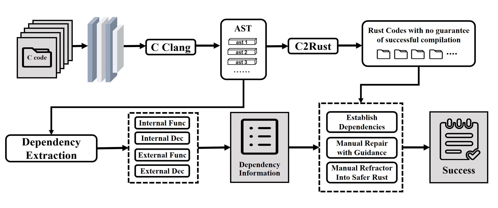

# Enhanced-C2Rust

Enhanced-C2Rust (EC2Rust) 是一个基于 [C2Rust](https://github.com/imnunant/c2rust) 的增强版 C 语言到 Rust 语言的转换工具。主要专注于C语言编写的基础命令行类型工具的转换。

其中C2Rust提供基础的C语言翻译能力，增强部分主要提供了自动化、可视化的依赖分析工具和自动化依赖构建工具，以增强C2Rust在基础命令行工具的转换上的能力。

以下是用C语言转换基础命令行工具为Rust的流程图：



## 安装

### 依赖

EC2Rust 需要 LLVM 7 或更高版本，对应的 clang 编译器和库, Python 3.6 或更高版本, CMake 3.4.3 或更高版本, 以及 openssl (1.0)。这些依赖可以通过以下命令安装：

- **OpenEuler 22.03:**

    ```sh
    dnf install python cmake pkg-config grpc-devel grpc-plugins protobuf-devel c-ares-devel gtest-devel gmock-devel llvm-libs-12.0.1-2.oe2203 llvm-devel-12.0.1-2.oe2203 clang-devel
    ```

### 从git安装

```sh
cargo install --git https://github.com/licheam/c2rust.git ec2rust
```

## Acknowledgements and Licensing

This material is available under the BSD-3 style license as found in the
[LICENSE](./LICENSE) file.

The EC2Rust translator is based on the [C2Rust](github.com/immunant/c2rust) translator.
